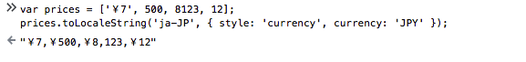

[TOC]
## Array 类型方法整理

### 数组的特殊性
和其他语言相比，JavaScript 中数组的特殊性在于：

* 数组的每一项都可以保存任意类型的数据。
* 数组的 `length` 属性不仅可读，而且可写。
	* 读
	
	* 写
	
		通过设置 `length` 值，可以从数组的末尾移除项或向数组中添加新项
		
		``` javascript
		const arr1 = [1,2,3];
		arr1.length = 1; // [1]
		// 稀疏数组
		arr1.length = 3; // [1, empty × 2]
		```

### 方法介绍

方法根据功能大概分为以下几类：

#### 创建方法

##### ES5

1. 构造函数

	``` javascript
	// new 关键字可以省略
	
	const arr1 = new Array(); // []

	const arr4 = new Array('m', 'n'); // ["m", "n"]
	
	// 注：给构造函数传递一个参数的时候，会根据参数的类型，有不同的行为
	const arr3 = new Array('3'); // ['3']
	const arr2 = new Array(3); // [empty × 3] 注意这里每一项的值是空(稀疏数组)

	```
	
	* 稀疏数组: 含有空白或者空缺单位的元素。
		* delete
		* in

		``` javascript
		const arr1 = [1,2,3];
		// delete 和 splice() 方法的不同之处
		delete arr1[1]; // [1, empty, 3]
		
		1 in arr1; // false
		2 in arr1; //true
		```
	
		 空白单元可能会有出乎意料的行为，比如 `map()` 方法和 `join()` 方法。
		
		``` javascript
		const arr1 = [1, 2, 3];
		delete arr1[1];
		
		<!--针对空白单元，map方法无法遍历-->
		const arr2 = arr1.map((item, index) => {return index}); // [0, empty, 2]
		
		<!--join方法会假定数组不为空-->
		arr1.join('*'); // "0**2"
		
		<!-- 在创建 undefined 值的数组时有些奇怪和繁琐，但是结果远比 Array(3) 更准确可靠。-->
		Array.apply(0, {length: 4}); // [undefined, undefined, undefined, undefined]
		
		<!--优雅的实现-->
		Array.from({length: 4});
		[...Array(4)]; // [undefined, undefined, undefined, undefined]
		
		```
		
		**注意： 空白单元可能会有出乎意料的行为，所以不要创建和使用稀疏数组。**

2. 数组字面量

	``` javascript
	const arr1 = ['m', 'n'];
	```

##### ES6

1. from
	> Array 从类似数组或类的对象中创建一个新的，浅拷贝的实例。
	
	将类数组对象转变为真正的数组对象。
	
	``` javascript
	<!-- 第一个参数： 类数组对象 -->
	Array.from('foo'); // ["f", "o", "o"]
	
	<!-- 第二个参数： 函数-->
	Array.from([1, 2, 3], x => x + x); // [2, 4, 6]
	
	<!-- 第三个参数： 指定函数内部的this值-->
	let helper = {     
		diff: 1,     
		add(value) {         
			return value + this.diff;     
		} 
	}; 
	function translate() {     
		return Array.from(arguments, helper.add, helper); 
	} 
	let numbers = translate(1, 2, 3);
	console.log(numbers); // [2, 3, 4]
	```

2. of
	> 无论参数的数量或类型如何，该 Array.of() 方法都会创建一个 Array 具有可变数量参数的新实例。
	
	弥补构造函数的缺陷。
	
	``` javascript
	new Array(7); // [empty × 7]
	Array.of(7); // [7]
	```

#### 检测数组

确定某个对象是不是数组的经典问题：

参阅： [检测数组方法](https://www.w3cplus.com/javascript/array-part-2.html)

1. instanceof
	> 测试一个对象在其原型链中是否存在一个构造函数的 prototype 属性。
	
	也就是判断 instanceof 前面的对象是否是后面的类或对象的实例。

	``` javascript
	const arr1 = [1,2,3];
	arr1 instanceof Array; // true
	```

	前提： 假设存在单一的全局环境。
	
	问题： 不同的全局执行环境可能存在不同版本的 Array 构造函数。
	
2. constructor 属性
	
	> 返回创建实例对象的 Object 构造函数的引用。
	
	``` javascript
	const arr1 = [1,2,3];
	arr1.constructor === Array; // true
	```
	
	存在的问题和 instanceof 相同。
	
3. 对象原生 toString 检测
	
	``` javascript
	const arr1 = [1, 2, 3];
	Object.prototype.toString.call(arr1) === "[object Array]"; // true

	```

4. isArray
	
	ES5 原生支持的方法，确定某个值是否是数组。
	
	问题： IE8 之前的版本是不支持的。

[数组检测 More > >](https://developer.mozilla.org/en-US/docs/Web/JavaScript/Reference/Global_Objects/Array/toLocaleString)

	
#### 转换方法

1. toString
	> 返回一个表示指定数组及其元素的字符串。
	
	每个元素都会调用 `toString()` 方法
	
	``` javascript
	const arr1 = [1, 2, 3];
	arr1.toString(); /"1,2,3"
	```
	
2. toLocalString
	> 返回一个表示数组元素的字符串。这些元素使用它们的 toLocaleString 方法转换为字符串，并且这些字符串由特定于语言环境的字符串分隔。
	
	`toLocalString()` 是 `toString()` 的本地化版本。
	
	可以传递两个参数：
	
	``` javascript
	// locales: 一个带有 BCP 47 语言标签的字符串或这种字符串的数组。
	// options: 具有配置属性的对象。
	arr.toLocalString(locales, options);
	```
	
	火狐支持参数传递，chrome 不支持：
	
	
	
3. valueOf

	> 返回指定对象的原始值。
	> 很少用到。
	

	``` javascript
	const arr1 = [1,2,3];
	arr1.valueOf(); // [1,2,3]
	```
	
4. join
	> 将数组（或类似数组的对象）的所有元素连接到一个字符串中并返回该字符串。
	
	注： **如果元素是 undefined 或 null，它将被转换为空字符串, NaN 转为字符串 "NaN"。**
	
	``` javascript
	const arr1 = [null, undefined, NaN];
	arr1.join(); // ",,NaN"
	```

##### ES6 

1. 扩展运算符 `...`
	
#### 栈方法
> LIFO - 后进先出

1. push
	> 接收任意数量的参数，逐个添加到数组的尾部，并返回 **修改数组的长度**。

2. pop
	> 从数组末尾移除最后一项，减少数组的 length 值，返回 **移除的项**。

#### 队列方法
> FIFO - 先进先出

1. shift
	> 移除数组的第一项，减少数组长度，返回 **移除的项**
2. unshift
	> 数组前端添加任意个项，并返回 **数组的长度**

* push() + shift: 队列
* pop() + unshift()：反向队列

#### 重排序方法

1. reserve
	> 反转数组项顺序

2. sort
	> 重排序，默认按照升序，默认排序并不靠谱，通常根据自定义的比较函数进行排序，比较函数接收两个参数，返回一个数值，根据数值的正负影响排序结果。

#### 操作方法

1. concat
> 创建当前数组的一个副本，然后讲将接收到的参数添加到副本的末尾，返回新构建的数组。
> concat() 的参数可以是一个或多个数组。

2. slice
> 基于当前数组的一个或多个项创建一个新的数组。
> 参数：返回项的起始位置，结束位置（可选）。

	**以上两个方法都不会影响原数组。**

3. splice

* 删除
	* 参数：开始位置、删除项数量
* 插入
	* 参数：起始位置，0，要插入的项
* 替换
	* 参数：起始位置，要删除的项，要插入的项

##### ES6

受到 [类型化数组](https://developer.mozilla.org/zh-CN/docs/Web/JavaScript/Typed_arrays) 的启发：

1. copyWithin
	> 在当前数组内部，将指定位置的成员复制到其他位置，会覆盖原有成员。
	
	* 参数
		* target（必需）：目标开始位置
		* start：读取数据开始位置
		* end： 该位置前停止读取数据
	
	``` javascript
	Array.prototype.copyWithin(target, start = 0, end = this.length)
	```
2. fill
	> 使用指定值填充数组
	
	* 数组初始化
	
	``` javascript
	new Array(3).fill(7) // [7, 7, 7]
	```
	
	* 参数：
		* content：填充内容
		* start：开始位置
		* end:  到该位置之前结束
	
	``` javascript
	[1,2,3].fill(7, 1, 2); // [1, 7, 3]
	```
	
	注：  
	
	**如果起始位置或者结束位置为负数，则它们会被加上数组的长度来算出最终位置。  
	如果填充的类型为对象，那么被赋值的是同一个内存的对象。** 
	
#### 检索方法

1. indexOf
2. lastIndexOf

	参数： 要查找的项，表示查找起点位置的索引（可选）
	
	不同之处： 方向相反。
	
	返回值： 索引，没有找到则返回 -1。采用 === 进行比较。
	
	注： **无法识别 NaN**, 可以用 `includes()` 方法代替。
	
	``` javascript
	[NaN].indexOf(NaN); // -1
	[NaN].lastIndexOf(NaN); // -1
	```
3. filter
	> 遍历数组每一项，返回该函数会返回 true 的项组成的数组。


##### ES6

1. find
	> 返回第一个符合条件的数组成员。
	
	如果没有符合条件的成员，则返回 undefined。
	
	
	``` javascript
	[1, 5, 10, 15, 20].find((value, index, arr) =>  value > 9 && index > 2);  // 15
	```	

2. findIndex
	> 和find() 方法类似，但是返回第一个符合条件的数组成员的位置。
	
	``` javascript
	[1, 5, 10, 15, 20].findIndex((value, index, arr) =>  value > 9 && index > 2);  // 3
	```	
	
	如果没有符合条件的成员，就返回 `-1`。
	
	两个方法参数相同：
	
	* 回调函数
		* 参数
			* 当前的值
			* 当前的位置
			* 原数组
	* 指定回调函数内部的 this（可选）
		
	比较：
		
		find() 与 findIndex() 方法均会在回调函数第一次返回 true 时停止查找。
		find() 与 findIndex() 方法更适合查找满足特定条件的数组元素，index() 和 indexOf() 更适合查找特定值。
	
3. includes
	> 判断一个数组是否包含一个指定的值。
	
	返回：true / false

	``` javascript 
	<!-- 可以识别出来 NaN -->
	[NaN].includes(NaN); // true
	```
	 
	
#### 迭代方法

1. every
	> 遍历数组每一项，都返回true，则返回true。

2. some

	> 遍历数组每一项，任意一项返回true, 则返回true。

4. map
	> 遍历数组每一项，返回每次函数调用的的结果组成的数组。

5. forEach
	> 遍历数组每一项，对数组每一项运行函数，没有返回值。

##### ES6

1. entries

> 键值对的遍历

2. keys

> 键名的遍历

3. values

> 键值的遍历

**以上三个方法都返回遍历器对象。**

#### 缩小方法

参数：函数，作为缩小基础的初始值（可选）

不同：方向相反。

1. reduce
2. rediceRight

### 参考链接

[检测数组方法 - w3cplus](https://www.w3cplus.com/javascript/array-part-2.html)

[MDN - Array](https://developer.mozilla.org/en-US/docs/Web/JavaScript/Reference/Global_Objects/Array)

[《ECMAScript 6 入门》](http://es6.ruanyifeng.com/#docs/array)

[创建0-100的数组](https://www.jianshu.com/p/d6f855e5bc5c)