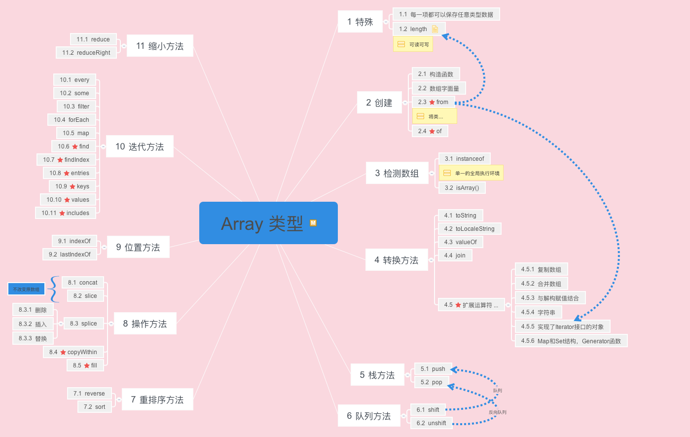

## Array 类型方法整理

### 总览



### 数组的特殊性
和其他语言相比，JavaScript 中数组的特殊性在于：

* 数组的每一项都可以保存任意类型的数据。
* 数组的 length 属性不仅可读，而且可写。
	* 读  
	
	* 写  
	
		通过设置 length 值，可以从数组的末尾移除项或向数组中添加新项
		
		```
		const arr1 = [1,2,3];
		arr1.length = 1; // [1]
		// 稀疏数组
		arr1.length = 3; // [1, empty × 2]
		```

	* 稀疏数组
		* delete 
		* in

		```
		const arr1 = [1,2,3];
		// delete 和 splice() 方法的不同之处
		delete arr1[1]; // [1, empty, 3]
		
		1 in arr1; // false
		2 in arr1; //true
		```

		
### 方法介绍

方法根据功能大概分为以下几类：

#### 创建方法

##### ES5

1. 构造函数

	```
	// new 关键字可以省略
	
	const arr1 = new Array(); // []
	
	// 注：给构造函数传递一个参数的时候，会根据参数的类型，有不同的行为
	const arr2 = new Array(3); // [empty × 3] 注意这里每一项的值是空
	const arr3 = new Array('3'); // ['3']
	
	const arr4 = new Array('m', 'n'); // ["m", "n"]
	```

2. 数组字面量

	```
	const arr1 = ['m', 'n'];
	```

##### ES6

1. from
	> Array从类似数组或类的对象中创建一个新的，浅拷贝的实例。
	
	将类数组对象转变为真正的数组对象。
	
	```
	Array.from('foo'); //["f", "o", "o"]
	Array.from([1, 2, 3], x => x + x); //[2, 4, 6]
	```

2. of
	> 无论参数的数量或类型如何，该 Array.of() 方法都会创建一个 Array 具有可变数量参数的新实例。
	
	弥补构造函数的缺陷。
	
	```
	new Array(7); // [empty × 7]
	Array.of(7); // [7]
	```

#### 检测数组

确定某个对象是不是数组的经典问题：

参阅： [检测数组方法](https://www.w3cplus.com/javascript/array-part-2.html)

1. instanceof
	> 测试一个对象在其原型链中是否存在一个构造函数的 prototype 属性。
	
	也就是判断instanceof前面的对象是否是后面的类或对象的实例。

	```
	const arr1 = [1,2,3];
	arr1 instanceof Array; // true
	```

	前提： 假设存在单一的全局环境。
	
	问题： 不同的全局执行环境可能存在不同版本的Array构造函数。
	
2. constructor 属性
	
	> 返回创建实例对象的 Object 构造函数的引用。
	
	```
	const arr1 = [1,2,3];
	arr1.constructor === Array; // true
	```
	
	存在的问题和 instanceof 相同。
	
3. 对象原生 toString 检测
	
	```
	const arr1 = [1, 2, 3];
	Object.prototype.toString.call(arr1) === "[object Array]"; // true
	
	```

4. isArray
	
	ES5原生支持的方法，确定某个值是否是数组。
	
	问题： IE8之前的版本是不支持的。
	
#### 转换方法

1. toString
	> 返回一个表示指定数组及其元素的字符串。
	
	每个元素都会调用 toString() 方法
	
	```
	const arr1 = [1, 2, 3];
	arr1.toString(); /"1,2,3"
	```
	
2. toLocalString
	>返回一个表示数组元素的字符串。这些元素使用它们的toLocaleString方法转换为字符串，并且这些字符串由特定于语言环境的字符串分隔。
	
	toLocalString() 是 toString() 的本地化版本。
	
	可以传递两个参数：
	
	```
	// locales: 一个带有BCP 47语言标签的字符串或这种字符串的数组。
	// options: 具有配置属性的对象。
	arr.toLocalString(locales, options);
	```
	
	火狐支持参数传递，chrome不支持：
	
	
	
	[More > >](https://developer.mozilla.org/en-US/docs/Web/JavaScript/Reference/Global_Objects/Array/toLocaleString)
	
	
3. valueOf

	> 返回指定对象的原始值。
	> 很少用到。
	

	```
	const arr1 = [1,2,3];
	arr1.valueOf(); // [1,2,3]
	```
4. join
	> 将数组（或类似数组的对象）的所有元素连接到一个字符串中并返回该字符串。
	
	注： **如果元素是 undefined 或 null，它将被转换为空字符串, NaN 转为字符串。**
	
	```
	const arr1 = [null, undefined, NaN];
	arr1.join(); // ",,NaN"
	```

##### ES6 
1. 扩展运算符 `...`

#### 栈方法

1. push
2. pop

#### 队列方法

1. shift
2. unshift

#### 重排序方法

1. reserve
2. sort

#### 操作方法

1. concat
2. slice
3. splice

##### ES6 

1. copyWithin
2. fill

#### 位置方法

1. indexOf
2. lastIndexOf

#### 迭代方法

1. every
2. some
3. filter
4. map
5. forEach

##### ES6

1. find
2. findIndex
3. entries
4. keys
5. values

#### 缩小方法

1. reduce
2. rediceRight


### 参考链接
[检测数组方法](https://www.w3cplus.com/javascript/array-part-2.html)