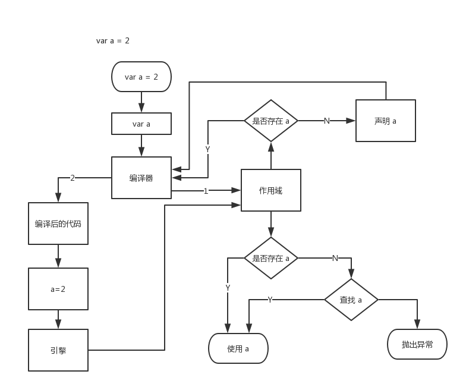

[toc]

# 你不知道的 JavaScript

## 作用域是什么
一套设计良好的规则来存储变量，并且之后可以方便的找到这些变量，这套规则称为作用域。

### 编译原理

#### 传统语言的编译过程

*  分词/词法分析

	词法单元（token）
	
*  解析/语法分析

	抽象语法树 AST
	
*  代码生成

	可执行代码

### 理解作用域

#### 演员表

* 引擎
	
	负责整个编译及执行
	
* 编译器

	负责语法分析、代码生成
	
* 作用域

	**负责收集并维护由所有声明的标识符（变量）组成的一系列查询，并实施一套非常严格的规则，确定当前执行的代码对这些标识符的访问权限。**

#### 对话

变量的赋值过程，如下图所示：

如图，变量的赋值会执行两个动作：

1. 声明变量
2. 查找变量，并赋值

#### 编译器有话说

编译器查找变量a:

1. LHS 查找
2. RHS 查找

