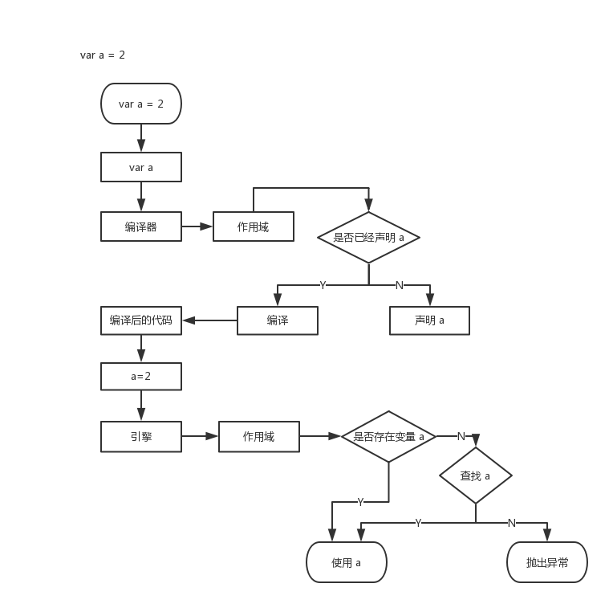

[toc]

# 你不知道的 JavaScript

## 作用域是什么
一套设计良好的规则来存储变量，并且之后可以方便的找到这些变量，这套规则称为作用域。

### 编译原理

#### 传统语言的编译过程

*  分词/词法分析

	词法单元（token）
	
*  解析/语法分析

	抽象语法树 AST
	
*  代码生成

	可执行代码

### 理解作用域

#### 演员表

* 引擎
	
	负责整个编译及执行
	
* 编译器

	负责语法分析、代码生成
	
* 作用域

	**负责收集并维护由所有声明的标识符（变量）组成的一系列查询，并实施一套非常严格的规则，确定当前执行的代码对这些标识符的访问权限。**

#### 对话

变量的赋值过程，如下图所示：



如图，变量的赋值会执行两个动作：

1. 声明变量
2. 查找变量，并赋值

#### 编译器有话说

编译器查找变量a:

1. LHS 查找

	LHS 查找试图找到变量的容器本身，进行赋值操作（写）
	
2. RHS 查找

	RHS 查找是获取到源值（读）
	
#### 引擎和作用域的对话

#### 查询的小测验

``` js
function foo(a) {
	var b = a;
	return a + b;
}

var c = foo(2);
```

* LHS 查询
	* a = 2
	* b = a
	* c = a + b
* RHS 查询
	* foo
	* a
	* a
	* b
	
### 作用域嵌套

查找： 从内向外

遍历规则： 引擎从当前的执行作用域开始查找变量，如果找不到，就像上一级继续查找，直到最外层的全局作用域停止。

### 异常

在非严格模式下，查询一个变量，如果在所有嵌套的作用域中查询不到所需变量：

`RHS查询` 中引擎会抛出 ReferenceError 异常；

 `LHS 查询` 则会在全局作用域中创建一个具有该名称的变量，并将其返还给引擎。
 
 注：
 
 ReferenceError： 作用域判别失败相关
 
 TypeError： 作用域判别成功，但是对结果的操作是非法或者不合理的
 
## 词法作用域

作用域工作模型：

1. 词法作用域
2. 动态作用域

### 词法阶段

词法化： 对源代码中的字符进行检查，如果是有状态的解析过程，还会赋予单词语义。

词法作用域： 定义在词法阶段的作用域。

#### 查找

引擎使用 作用域气泡的结构和相互之间的位置关系 查找标识符的位置。

作用域查找会在找到第一个匹配的标识符时停止。
 
 遮蔽效应： 在多级嵌套作用域中可以定义同名的标识符。
 
 全局变量： 自动成为全局对象的属性，因此可以通过对全局对象属性的引用来对其进行访问。可以通过这个方式访问被同名变量遮蔽的全局变量。
 
 函数的词法作用域是由函数被声明时所处的位置决定，和函数调用没有关系。
 
### 欺骗词法

在运行时修改词法作用域：

会导致性能下降。

机制：

#### eval

``` js
eval(string)
// string: 表示JavaScript代码
// 返回值：执行代码之后的返回值
```

#### with 
 
 1. 重复引用同一个对象中的多个属性的快捷方式，不需要重复引用对象本身

 ``` js
	 function foo(obj) {
		with (obj) {
			a = 2;
		}
	 }
	 
	 var o1 = {
	 	a: 3
	 };
	 var o2 = {
	 	b: 3
	 };
	 
	 foo(o1);
	 console.log(o1.a); // 2
	 
	 foo(o2);
	 console.log(o2.a); // undefined
	 console.log(a); // a 被泄露到全局作用域上了
 ```
 
 with 声明实际上根据传递的对象凭空创建了一个全新的词法作用域。
 
#### 性能

JavaScript 引擎会在编译阶段进行数项的性能优化。其中有些优化依赖于能够提供代码的词法进行静态分析，并预先确定所有变量和函数的定义位置，才能在执行过程中快速找到标识符。

注意： 不要使用 eval 和 with。

## 函数作用域和块作用域

### 函数中的作用域

含义： 属于这个函数的全部变量都可以在整个函数的范围内使用及复用（事实上在嵌套的作用域中也可以使用）。

### 隐藏内部实现

从所写的代码中挑选任意一个片段，然后用函数声明对它进行包装，实际上就是讲这些代码隐藏在函数作用域中。

隐藏的好处：

* 最小特权（最小授权、最小暴露）原则
	
	在软件设计中，应该最小限度地暴露必要内容，而将其他内容都隐藏起来。
	
* 避免同名标识符之间的冲突
	
#### 规避冲突

* 全局命名空间

	第三方库： 在全局作用域中声明一个名字足够独特的变量，通常是一个对象。 这个对象被用作库的命名空间，所有需要暴露给外界的功能都会成为这个对象的属性，而不是将自己的标识符暴露在顶级的词法作用域中。

* 模块管理

	和现代模块机制很接近，从众多模块管理器中挑选一个来使用。保证任何库都无需将标识符加入到全局作用域中，而且通过依赖管理器的机制将库的标识符显式的导入到另一个特定的作用域中。
	
### 函数作用域

函数名污染全局作用域的解决方案：

```js 
// foo 被绑定在函数表达式自身的函数中而不是所在作用域中
（function foo () { ... }) ();
```

#### 匿名和具名

1. 匿名函数

	缺点：
	* 调试困难。匿名函数在栈追踪中不会显示出有意义的函数名，使得调试困难。
	* 函数引用自身困难。只能使用已过期的 arguments.callee 引用。比如递归调用，事件触发后事件监听器需要解绑自身。
	* 可读性差
	
	最佳实践： 始终给函数表达式命名是一个最佳实践。
	
#### 立即执行函数表达式 IIFE

形式：

``` js
(function () { ... }) ()
(function () { ... } () )
```

用法：

* 使用一个匿名/具名函数表达式
* 当做函数调用并传递参数

	``` js
	var a = 2;
	(function IIFE (global) {
		var a = 3;
		console.log(a);
		console.log(global.a);
	}) (window);
	
	console.log(a);
	```
* 倒置代码的运行顺序，将需要运行的函数放在第二位，在 IIFE 执行之后当作参数传递进去

	``` js
	var a = 2;
	(function IIFE ( def ) {
		def (window);
	}) (function def (global) {
		var a = 3;
		console.log(a);
		console.log(global.a);
	})
	```
### 块作用域

用来对之前的最小授权原则进行扩展的工具，将代码从在函数中隐藏信息扩展为在块中隐藏信息。

#### with

#### try/catch

#### let 

将变量绑定到所在的任意作用域中，通常是{ ... } 内部。这种行为是隐式的，也可以为块作用域显示的创建块使变量的附属关系更加清晰。

变量提升。

* 垃圾收集
* let 循环

#### const

## 提升

### 先有鸡还是先有蛋
声明在前还是赋值在前？
声明在前。

``` js
	a = 2;
	var a;
	console.log(a); //2
	
	console.log(b);
	var b = 2; // undefined
```

### 编译器再度来袭

包括变量和函数在内的所有声明都会在任何代码被执行前首先处理。

这个过程就好像变量和函数声明从它们在代码中出现的位置被移动到最上面，这个过程就叫做提升。

函数声明会被提升，但是函数表达式不会被提升。

### 函数优先

函数声明和变量都会被提升，但是函数会优先提升，然后才是变量。

``` js
	foo();
	var foo;
	
	function foo () {
		console.log(1);
	}
	
	foo = function () {
		console.log(2);
	}
	
	// 1
```

注意： var foo 会被忽略，因为是重复的声明。但是出现在后面的函数声明还是可以覆盖前面的，所以不要再同一个作用域中进行重复定义。

## 作用域闭包

### 启示

JavaScript中闭包无处不在，你只需要能够识别并拥抱它。

### 实质问题

当函数可以记住并访问所在的词法作用域时，就产生了闭包。即使函数是在当前词法作用域之外执行。

闭包的神奇之处在于可以**阻止引擎的垃圾回收器释放不再使用的内存空间**。因为实际上作用域还在被使用。

无论通过何种手段将内部函数传递到所在的词法作用域以外，它都会持有对原始定义作用域的引用，无论在何处执行这个函数都会使用闭包。

### 搞懂闭包

如果将函数当作第一级的值类型并到处传递，就可以看到闭包在这些函数中的应用。

只要使用了回调函数，实际上就是在使用闭包。

### 循环和闭包

每秒输出一个数字：

``` js
	for (var i = 1; i <= 5; i++) {
		setTimeout(function timer() {
			console.log(i);
		}, i*1000)
	}
	// 输出5个6
```
添加闭包：

``` js
	for (var i=1; i<=5; i++) {     
		(function(j) { 
			setTimeout( function timer() {             
			console.log( j );        
			 }, j*1000 );     
		 })(i); 
	 }
```

#### 重返块作用域
块作用域和闭包结合

``` js
for (let i = 1; i <= 5; i++) {
	setTimeout(function timer() {
		console.log(i);
	}, i*1000);
}
```

### 模块

模块模式的必要条件：

1. 必须有外部的封闭函数，该函数必须至少被调用一次（每次调用都会创建一个新的模块实例）
2. 封闭函数必须返回至少一个内部函数，这样内部函数才能在私有作用域中


     